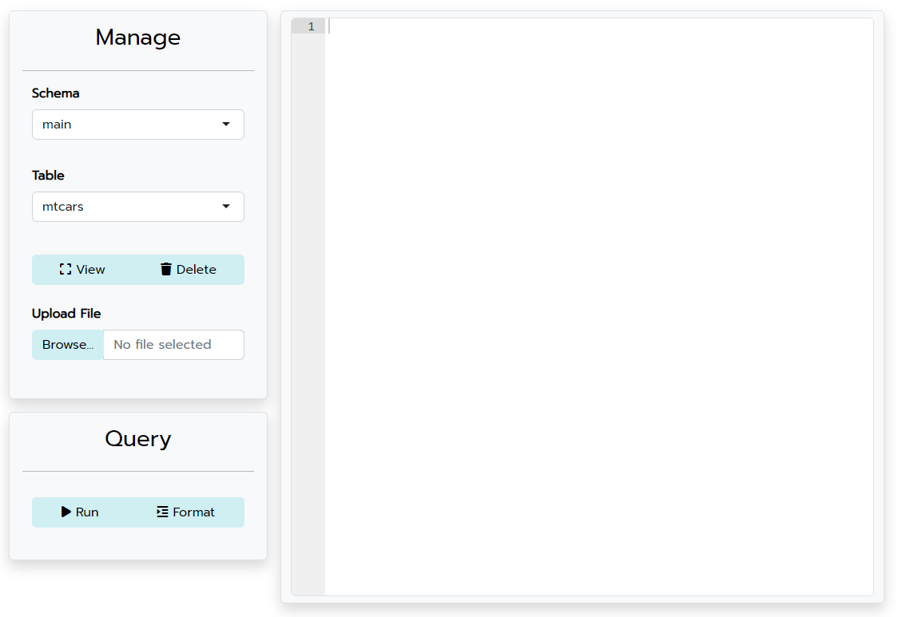

<!-- README.md is generated from README.Rmd. Please edit that file -->

```{r, include = FALSE}
knitr::opts_chunk$set(
  collapse = TRUE,
  comment = "#>",
  fig.path = "man/figures/README-",
  out.width = "100%"
)
```

# octopus

<!-- badges: start -->

<!-- badges: end -->

The *octopus* package is an SQL editor built entirely in R. You can preview tables, upload files, send queries, and more.

All database credentials are handled by the R user. Simply pass a supported database connection object created with DBI::dbConnect() to the function octopus::view_database() and *octopus* will start a shiny application allowing you to interact with the database.



## Supported Databases

The *octopus* package currently supports the following databases:

-   Postgres

-   MySQL

-   SQLite

-   DuckDB

-   Snowflake

-   Teradata

-   Vertica DB

Don't see the database that you use? I would be glad to add it. Just reach out to me and we can work together to create compatibility for a new connection type.

## Installation

*octopus* is officially on CRAN! You can install it in the usual way.

``` r
install.packages("octopus")
```

Or the development version from github.

``` r
devtools::install_github("MCodrescu/octopus")
```

## Example

Here is an example of connecting to a database and running the main function of octopus.

```{r example, eval = FALSE}
# Create a Database Connection
con <-
  DBI::dbConnect(
    RPostgres::Postgres(),
    host = "localhost",
    user = "postgres",
    password = keyring::key_get("DBPassword")
  )

# View the Database
octopus::view_database(con)

```
