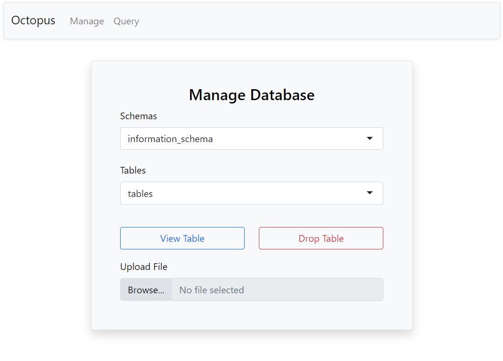
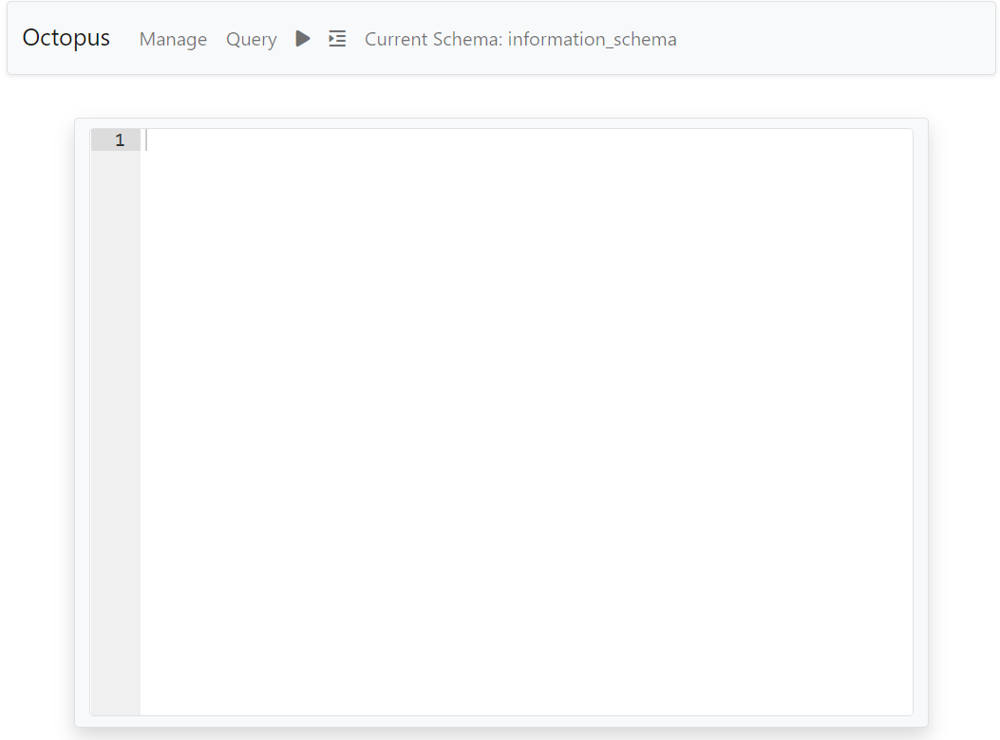

<!-- README.md is generated from README.Rmd. Please edit that file -->

# octopus

<!-- badges: start -->
<!-- badges: end -->

The goal of octopus is to allow R users to visually interact with
databases. The package has database specific functions for viewing
tables, uploading files, sending queries, and more.

All database credentials are handled by the R user. Simply pass a
supported database connection object to the function view_database() and
*octopus* will start a shiny application allowing you to interact with
the database.





## Supported Databases

The octopus package currently supports the following databases:

- Postgres

- MySQL

## Installation

You can install the development version from github.

``` r
devtools::install_github("MCodrescu/octopus")
```

## Example

Here is an example of connecting to a database and running the main
function of octopus.

``` r
# Create a Database Connection
con <-
  DBI::dbConnect(
    RPostgres::Postgres(),
    host = "localhost",
    user = "postgres",
    password = keyring::key_get("DBPassword"),
    port = 5432
  )

# View the Database
octopus::view_database(con)
```
